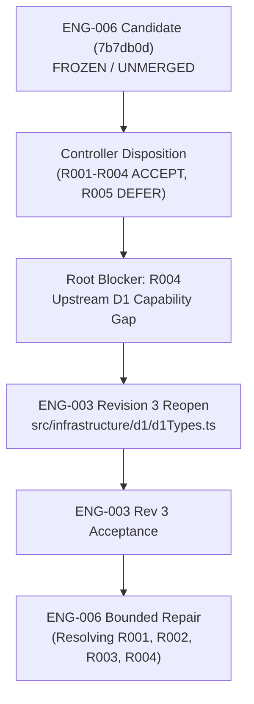

# ENG-006 Controller Finding Disposition

**Artifact class:** OPERATIONAL / CONTROLLER RECORD
**Lifecycle status:** SUPERSEDED
**Record role:** HISTORICAL FINDING DISPOSITION
**Date:** 2026-08-15
**Failed candidate:** `7b7db0d98660f6562f8e9738445be725fc65988c`
**Deterministic verification:** PASS
**Semantic review:** NEEDS FIX
**Closure:** BLOCKED
**Human Reserved:** NOT REQUIRED

> [!NOTE]
> This record preserves the Controller disposition of the failed initial candidate. Its repair directions and next steps are historical, consumed, and non-operative. ENG-006 Repair Rev1 was subsequently accepted and ENG-006 closed through [`ENG-006_REPAIR_REV1_CONTROLLER_CLOSURE_2026-08-23.md`](ENG-006_REPAIR_REV1_CONTROLLER_CLOSURE_2026-08-23.md). The failed candidate remains frozen and unaccepted.

---

## 1. Executive Summary

On 2026-08-15, the initial candidate for `ENG-006` (Direct-SQL Retrieval & Resumption) was produced at commit `7b7db0d98660f6562f8e9738445be725fc65988c` (tree `18b97d99aa95cc37801e8db63fb7940f1945d11b`, aggregate `2c7937fbb22c078dec5699204c4f1c44504b4ee308c52ad6881b6711435d82c3`).

Independent deterministic verification succeeded against the candidate's local test harness (`PASS`). However, subsequent independent semantic and architectural review returned `NEEDS FIX` across five distinct findings (`R001` through `R005`).

The Controller has adjudicated the review findings, established the root blocker as an upstream infrastructure capability gap (`R004`), and determined that a bounded upstream reopen of `ENG-003` (Revision 3) is required before `ENG-006` repair implementation may proceed.

The failed `ENG-006` candidate remains **FROZEN** and unmerged.

---

## 2. Complete Finding Dispositions

| Finding ID | Priority / Severity | Category | Finding Summary | Controller Disposition | Action / Disposition Target |
|---|---|---|---|---|---|
| `ENG-006-R001` | **P0 / BLOCKING** | `WORK_PRODUCT_DEFECT` | Query execution error handling: collection query must never return `found: []` unless a valid collection result was obtained; missing `all()`, query error, or malformed result must return `retrieval-failed` | **ACCEPT** | `ENG-006` Repair Requirement |
| `ENG-006-R002` | **P0 / BLOCKING** | `WORK_PRODUCT_DEFECT` | Collection row mapping integrity: if any row cannot be faithfully mapped, whole collection retrieval must fail with `retrieval-failed`; no silent row dropping or partial found results | **ACCEPT** | `ENG-006` Repair Requirement |
| `ENG-006-R003` | **P0 / BLOCKING** | `WORK_PRODUCT_DEFECT` | Knowledge lineage integrity: all predecessors must exist, origin match, no duplicates/cycles; persisted oldest→newest order preserved without sorting; target appended last | **ACCEPT** | `ENG-006` Repair Requirement |
| `ENG-006-R004` | **P0 / BLOCKING** | `UPSTREAM_CAPABILITY_GAP` | `d1Types.ts` lacks collection-read capability (`all`), forcing parallel database contracts and unsafe casts | **ACCEPT (ROOT BLOCKER)** | `ENG-003` Revision 3 Upstream Reopen |
| `ENG-006-R005` | **P2 / NON-BLOCKING** | `ARCHITECTURE_CONSTRAINT` | Querying child collections for non-existent parent Project returns `found: []` rather than `not-found` | **DEFER TO ENG-010** | `ENG-010` Downstream Integration Constraint |

---

## 3. Detailed Finding Analysis & Adjudication

### Finding R001: Collection Query Execution Error Handling
- **Classification:** `WORK_PRODUCT_DEFECT` (Blocking)
- **Defect Description:** In `src/application/services/retrieval/retrievalService.ts`, collection queries could falsely return `{ kind: "found", value: [] }` when a valid D1 collection result was not obtained (e.g., helper defaulting to empty array on missing `stmt.all` or failed execution).
- **Controller Adjudication:** **ACCEPT**. A collection query must never return `found: []` unless a valid collection result was successfully obtained from the database. A missing `all()` method, rejected query, or malformed collection result must produce `{ kind: "retrieval-failed", reason: "database-query-error", retryable: false }`.
- **Remediation for Later ENG-006 Repair:** Ensure all query execution paths validate collection results and fail fast on any error.

### Finding R002: Collection Row Mapping Integrity
- **Classification:** `WORK_PRODUCT_DEFECT` (Blocking)
- **Defect Description:** Mapping loops for projects, actions, facts, progress, and knowledge items silently dropped unmappable or corrupted rows (e.g., `if (mapped !== undefined) { items.push(mapped); }`), allowing database corruption or schema divergence to produce a partial successful result.
- **Controller Adjudication:** **ACCEPT**. If ANY authoritative collection row cannot be faithfully mapped to its domain entity, the WHOLE collection retrieval must return `{ kind: "retrieval-failed", reason: "database-query-error", retryable: false }`. No row may be silently dropped; no partial `found` result is permitted.
- **Remediation for Later ENG-006 Repair:** Refactor mapping loops to immediately abort and return `retrieval-failed` if any row fails canonical mapping.

### Finding R003: Knowledge Lineage Integrity & Chronology
- **Classification:** `WORK_PRODUCT_DEFECT` (Blocking)
- **Defect Description:** Lineage traversal in `getKnowledgeLineage` had integrity defects (silently ignoring missing predecessors) and did not explicitly document or assert the strict integrity and chronology contract for historical knowledge chains.
- **Lineage Integrity & Chronology Rules:**
  - Every declared predecessor in `supersessionChain` must exist in persistence; missing predecessor => `retrieval-failed`.
  - Duplicate predecessor ID in chain => `retrieval-failed`.
  - Target/self ID inside predecessor chain => `retrieval-failed` (cycle detection).
  - Predecessor originatingProjectId must equal target originatingProjectId => mismatch produces `retrieval-failed`.
  - Malformed persisted chain => `retrieval-failed`.
  - Persisted `supersessionChain` order is authoritative oldest→newest (guaranteed by domain, provenance service, SQLite triggers, and accepted tests).
  - Retrieval preserves persisted order and MUST NOT sort or reorder it.
  - The target item is appended last in the assembled lineage array.
- **Controller Adjudication:** **ACCEPT**. Lineage assembly must enforce complete referential and historical integrity across the entire supersession chain.
- **Remediation for Later ENG-006 Repair:** Implement full lineage validation according to the exact contract above.

### Finding R004: Upstream D1 Collection-Read Capability Gap (Root Blocker)
- **Classification:** `UPSTREAM_CAPABILITY_GAP` (Blocking — Root Cause)
- **Defect Description:** The accepted D1 abstraction in `src/infrastructure/d1/d1Types.ts` (delivered in `ENG-003` revision 2) defined `D1PreparedStatement` with only `bind(...)` and `first(...)`. It omitted `all(...)`, which is required for direct-SQL collection reads. To circumvent this upstream omission, the ENG-006 candidate created a parallel task-local `RetrievalDatabaseLike` / `RetrievalPreparedStatement` contract in `retrievalTypes.ts` with optional `all?`, and used unsafe casts (`as unknown as RetrievalDatabaseLike`) in test harnesses.
- **Controller Adjudication:** **ACCEPT — ROOT BLOCKER**. Application services must not introduce parallel database contracts or unsafe type bridges to work around missing infrastructure types. The D1 abstraction must provide the minimal, truthful collection-read capability directly in `d1Types.ts`.
- **Required Action:** Authorize targeted upstream reopen `ENG-003` (Revision 3) to add `all<T>()` and `D1ReadAllResult<T>` to `src/infrastructure/d1/d1Types.ts`.

### Finding R005: Parent Project Existence on Empty Child Collections
- **Classification:** `ARCHITECTURE_CONSTRAINT` (Non-Blocking for ENG-006)
- **Defect Description:** When `getActionsForProject`, `getAcceptedContextFacts`, `getCurrentProgress`, or `getCurrentKnowledgeForProject` is called for a non-existent `ProjectId`, SQL `SELECT` returns 0 rows, resulting in `{ kind: "found", value: [] }`. The review questioned whether this should return `{ kind: "not-found", entityType: "project", id: projectId }`.
- **Controller Adjudication:** **DEFER TO ENG-010**. In direct SQL retrieval, a collection query is a filter over child rows. Requiring every child collection query to execute an extra `SELECT FROM projects` query adds unnecessary round-trips and violates ARC-005. Downstream interaction orchestration (`ENG-010`) owns establishing parent Project existence via `getProject` before interpreting child collections.
- **Disposition Target:** Preserved in `STRONG_MODEL_REVIEW_REGISTER.md` as an explicit downstream integration constraint for `ENG-010`.

---

## 4. Operational State & Next Steps

1. **ENG-003 Revision 3:** Prepare and submit Task Packet Draft (`ENG-003_REV3_D1_READ_CAPABILITY_DRAFT_2026-08-15.md`) for Controller review and dispatch authorization.
2. **ENG-006 Status:** Execution remains **BLOCKED** on upstream `ENG-003` revision 3 acceptance. No ENG-006 repair Builder is authorized at this time.
3. **Failed Candidate:** Commit `7b7db0d98660f6562f8e9738445be725fc65988c` remains frozen as immutable historical review evidence.
